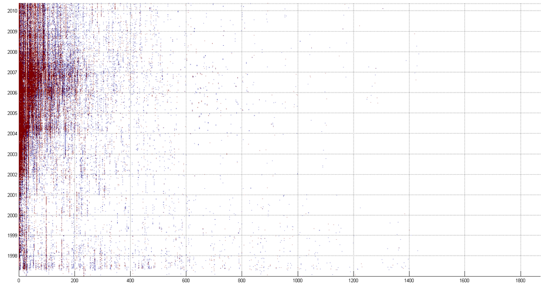
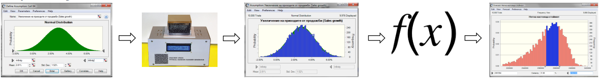

# Some ideas on data synthesis & Data creation

# Angel Marchev

# What?

\(  What is Synthetic Data?\)

mimics real\-world data

created\, rather than collected

can be generated in large quantities

can be generated with specific properties

may not always accurately reflect the complexities and variability of real\-world data\, so its results should be used with caution

# WHY?

\(Why create data as means for data analysis?\)

imbalanced data \(incl\. short dataset\) => oversampling\, validation data

feature engineering \(incl\. non\-linear transform\) => transformation

missing data => partial imputation

data privacy regulations => synthetic dataset

lack of real data => synthetic dataset

cost savings => synthetic dataset

\(main emphasis today is synthesis of structured data\, but some imputation is also within the scope due to methodical

# 

# Data imputation

various reasons for missing data\, but main reasoning for imputation is if the missing data is related to other variables

 _ _    _Blue points are observations whereas red points are missing observations in the y\-variable; _    _statistics for complete data \(blue and red combined\) are slope \(b\) = 1\, standard error \(se\) = 0\.05 and R2 = 0\.5\. Assuming observations in the x\-variable are complete\, \(a\) represents missing at random \(MAR\)\, \(b\) represents missing not at random \(MNAR\) and \(c\) represents missing completely at random \(MCAR\)\. For the observed data \(blue points\)\, the estimated slope\, se and R2\, are \(a\) b = 0\.86\, se = 0\.11\, R2 = 0\.29\, \(b\) b = 0\.432\, se = 0\.06\, R2 = 0\.23 and \(c\) b = 0\.957\, se = 0\.07\, R2 = 0\.49\._ 

# Imputation methods

inference based \(crosslinked\) modeling \(horizontal && vertical\)

vs

   single variable imputation \(vertical\)

Single variate  	  	    Multi\-variate

Monotonous  	  	    General

Alternate  	  	  	    Factorial \(Latent\)

# Data imputation tricks

distribution preservation noise

“  unknown” class

mean by subclass instead of the whole variable

The orthogonal view

# Distribution altering single variable imputation

Linear interpolation

Mean of the known values

# Random Naive Oversampling

randomly duplicating instances from the minority class until it is balanced with the majority class

For example\, if the minority class has only 30% of the instances in a dataset\, then random naive oversampling would involve duplicating instances from the minority class 3 times

it does not take into account the relationships between the features and the class labels \(hence called “naive”\)\.

The simplest possible technique

can lead to overfitting\, where the model trains to replicate too closely the repeated class\.

# SMOTE and Variants

SMOTE \(Synthetic Minority Over\-sampling Technique\) is an algorithm for generating synthetic data\, specifically designed to address the problem of imbalanced datasets

In a binary classification problem\, SMOTE generates synthetic samples of the minority class by interpolating between existing minority class samples\. 

Preserves the intrinsic characteristics of the minority class\. 

 __SMOTE__    \(and its many variations\) use the same algorithm to generate new samples\. Considering a sample    __x__    _i_   \, a new sample    __x__    _new_    will be generated considering its k\- neareast\-neighbors \(corresponding to    __k__    _neighbors_   \)\. 

For instance\, the 3 nearest\-neighbors are included in the blue circle as illustrated in the figure below\. Then\, one of these nearest\-neighbors    __x__    _zi_    is selected and a sample is generated as follows:

      __x__    _new_    __ = x__    _i_    __ \+ __    __λ \.__    __ \(x__    _zi_    __ \- x__    _i_    __\)__ 

where    __λ__    is a random number in the range \[0\, 1\]\. This interpolation will create a sample on the line between    __x__    _i_    and    __x__    _zi_    as illustrated in the image\.

SMOTE: This is the original implementation of SMOTE\, which generates synthetic samples by interpolating between pairs of minority class samples\. Specifically\, it selects a random minority class sample and its k\-nearest neighbors\, then generates new samples by interpolating between them\.

Borderline\-SMOTE: This variant of SMOTE generates synthetic samples for the borderline instances of the minority class\. It identifies the minority class instances that are near the decision boundary of the classifier and applies SMOTE only to those samples\.

Adaptive Synthetic Sampling \(ADASYN\): ADASYN is another variant of SMOTE that adapts the number of synthetic samples based on the density of the data distribution\. It generates more synthetic samples for minority class instances that are harder to learn\, thus reducing the bias in the classifier\.

Safe\-Level SMOTE: This is a variant of SMOTE that considers the distribution of the majority class and generates synthetic samples based on the safe\-level\, which is the difference between the minority and majority class densities\.

G\-SMOTE: This is a geometric variant of SMOTE that generates synthetic samples by extrapolating from the line segments joining k\-nearest neighbors\. It uses the geometry of the minority class samples to generate more realistic synthetic samples\.

K\-Means SMOTE: This variant of SMOTE uses k\-means clustering to generate synthetic samples for the minority class\. It first clusters the minority class samples using k\-means\, then generates synthetic samples for each cluster\.

The classifiers trained on synthetic examples generalize well\.

The classifiers Identify the minority class well \(True Negatives\)\.

They have fewer False Positives compared to undersampling\.

 _Advantages _ 

It improves the overfitting caused by random oversampling as synthetic examples are generated rather than a copy of existing examples\.

No loss of information\.

It’s simple\.

 _Disadvantages _ 

While generating synthetic examples\, SMOTE does not take into consideration neighboring examples that can be from other classes\. This can increase the overlapping of classes and can introduce additional noise\.

SMOTE is not very practical for high\-dimensional data\.

# Random numbers generators

# Monte-Carlo simulation

randomly generate many possible outcomes and use accumulation of these outcomes as an estimate of the expected value\.

Relays on Law of large numbers 

Useful when it is difficult or impossible to solve a problem analytically\. The method can provide good results even when the underlying system is complex or poorly understood\. 

# Statistical distributions

>100s

Each with its own set of parameters

Method of moments \(or GMM\)

for distribution fitting

# Generating synthetic observations

\(Methodological background \)

===Random===

Monte\-Carlo simulation

GAN

===Non\-random===

Inverse copula sampling

Cholesky decomposition

randomly sampling from a probability distribution

repeat the sampling process multiple times to accumulate many simulated data points

Analyze the generated synthetic data to validate that it resembles the distribution of the original data

a type of deep learning architecture

two neural networks: a generator and a discriminator

trained together in a zero\-sum game

copula is a function that describes a joint distribution of a set of variables

modeling the dependence structure between variables in the original data and preserve it

Cholesky decomposition is a factorization of a positive\-definite matrix

modeling the covariance structure between variables in the original data

\(Methodological framework\)

\(opt\.\) Analyze for minimum needed features

Data generation by \(chosen\) method

Horizontal synchronization

Feature \(vertical\) valida

# Use case: only distributions

* IF Separate distributions for every variable:
  * are available
  * could be derived from small representative sample
  * could be assumed
* AND business rules have to be derived
* THEN
  * Feature\-wise Monte Carlo simulation
  * Record\-wise business rules filtering

# Use case: distributions & correlations

* IF Separate distributions for every variable:
  * are available
  * could be derived from small representative sample
  * could be assumed
* AND correlations between each variable pair 
* are available
* THEN
  * Correlation matrix
  * Cholesky decomposition
  * Monte Carlo simulation
  * Pair wise product 

# Use case: joint distribution

* IF Multi\-variate joint distribution \(copula function\) is available
* THEN
  * Use copula function to generate simulated normalized sample vectors
  * De\-normalize using s  caling variables of each feature

# Use case: some real features

* IF partial real data set is available
* AND business rules have to be derived
* THEN
  * Derive new variables using:
    * Business rules
    * Scaling weights to the real variables
  * Record\-wise business rules filtering

# Use case: parts of data sets

* IF parts of various data sets are available:
  * From different sources
  * Real data 
  * Synthetic data
* AND there is overlap of at least two variables for every partial data set
* THEN
  * Use fuzzy matching algorithm to stich together the data sets on the overlapping \(key\) values
    * They might need to be recoded
  * In case of inconclusive fuzzy matching score or duplicates\, pick randomly \(probabilistic concatenation\)

# Use case: full data sets

* IF full data set is available:
  * confidential
  * sensitive
  * without license
* THEN
  * Generate initial random data set
  * Train Generative adversarial network on the real data set to generate synthetic data
    * Using the generative ANN\, generate values of simulated data 
    * Using discriminative ANN\, discriminate real data from simulated data
    * If discrimination is successful feed the result to the generative ANN for next simulation
    * Else feed the result to discriminative ANN to improve discrimination next time

# Less data limitations & challenges => => => => =>

# The Case

 _[https://github\.com/angel\-marchev/case\-cold\-start\-modeling](https://github.com/angel-marchev/case-cold-start-modeling)_ 

# See also

How to Use Synthetic and Simulated Data Effectively

 _[https://towardsdatascience\.com/how\-to\-use\-synthetic\-and\-simulated\-data\-effectively\-04d8582b6f88](https://towardsdatascience.com/how-to-use-synthetic-and-simulated-data-effectively-04d8582b6f88)_ 

Best Practices and Lessons Learned on Synthetic Data for Language Models

 _[https://arxiv\.org/pdf/2404\.07503\.pdf](https://arxiv.org/pdf/2404.07503.pdf)_ 

Google AI Introduces CodecLM: A Machine Learning Framework for Generating High\-Quality Synthetic Data for LLM Alignment

 _[https://www\.marktechpost\.com/2024/04/13/google\-ai\-introduces\-codeclm\-a\-machine\-learning\-framework\-for\-generating\-high\-quality\-synthetic\-data\-for\-llm\-alignment/](https://www.marktechpost.com/2024/04/13/google-ai-introduces-codeclm-a-machine-learning-framework-for-generating-high-quality-synthetic-data-for-llm-alignment/)_ 

List with publications:

1\. Marchev\, A\.\, Marchev\, V\.\, 2024\, Automated Algorithm for Multi\-variate Data Synthesis with Cholesky Decomposition\, ICACS 2023: the 7th International Conference on Algorithms\, Computing and Systems\, Larissa Greece\, Association for Computing Machinery\, New York\, pp\. 1 – 6\, ISBN:979\-8\-4007\-0909\-8\, DOI: 10\.1145/3631908\.3631909;

2\. Marchev\, V\.\, Marchev\, A\.\, Piryankova\, M\.\, Masarliev\, D\.\, Mitkov\, V\.\, 2023\, Synthesizing an anonymized multidimensional dataset featuring financial\, economic\, demographic\, and personal traits data\, VSIM\, vol\. 19\, no\. 1\, 2023\, ISSN 1314\-0582;

3\. Marchev\, A\.\, Marchev\, V\.\, 2022\. Synthesizing multi\-dimensional personal data sets\. AIP Conference Proceedings; 2505 \(1\): 020012\, DOI: 10\.1063/5\.0100615;

4\. Marchev\, V\, Marchev\, A\.\, 2021\, “Methods for Simulating Multi\-dimensional Data for Financial Services Recommendation”\, Bulgarian Economic Papers\, Center for economic theories and policies\, ISSN: 2367\-7082\, BEP 02\-2021\, Feb\. 2021\, BEP;

5\. Марчев В\.\, Марчев\, А\.\, 2020\, Симулация на многокритериална база от данни за банкови услуги\. Алгоритъм и бизнес логика\, „Новите информационни технологии и големите данни: възможности и перспективи при анализите и управленските решения в бизнеса\, икономиката и социалната сфера;

6\. Marchev\, V\. Marchev\, A\.\, 2024\, Anonymizing Personal Information Using Distribution\-based Data Synthesis\, in publishing\.

7\. Lyubchev\, D\.\, Marchev\, A\.\, Marchev\, V\., Inverse copula sampling for multi-dimensional data synthesis\(2024\)

8\. Marchev\, V\. Marchev\, A\., Methodological Considerations for Anonymizing Tabular Data Using Generative Adversarial Networks\(2025\)
