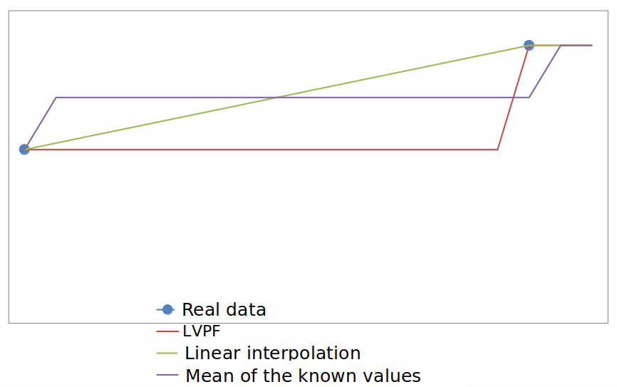
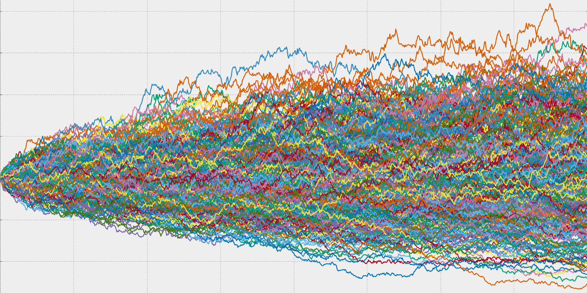

# Some ideas on data synthesis & Data creation

# Angel Marchev


<hr>

## What?

**(What is Synthetic Data?)**

* mimics real-world data

* created, rather than collected

* can be generated in large quantities

* can be generated with specific properties

* may not always accurately reflect the complexities and variability of real-world data, so its results should be used with caution

<hr>

## WHY?

**(Why create data as means for data analysis?)**

* imbalanced data (incl. short dataset) => oversampling, validation data

* feature engineering (incl. non-linear transform) => transformation

* missing data => partial imputation

* data privacy regulations => synthetic dataset

* lack of real data => synthetic dataset

* cost savings => synthetic dataset

(main emphasis today is synthesis of structured data, but some imputation is also within the scope due to methodical)

<hr>


<hr>

## Data imputation

* various reasons for missing data, but main reasoning for imputation is if the missing data is related to other variables

 

* Blue points are observations whereas red points are missing observations in the y-variable; statistics for complete data (blue and red combined) are slope (b) = 1, standard error (se) = 0.05 and R2 = 0.5. Assuming observations in the x-variable are complete, (a) represents missing at random (MAR), (b) represents missing not at random (MNAR) and (c) represents missing completely at random (MCAR). For the observed data (blue points), the estimated slope, se and R2, are (a) b = 0.86, se = 0.11, R2 = 0.29, (b) b = 0.432, se = 0.06, R2 = 0.23 and (c) b = 0.957, se = 0.07, R2 = 0.49.

<hr>

## Imputation methods

<table>
  <tr>
    <th align=left>
      <ul>
        <li>inference based (crosslinked) modeling (horizontal && vertical)</li>
        <li>vs</li>
        <li>single variable imputation (vertical)</li>
     </ul>
    </th>
    <th></th>
  </tr>
</table>

<hr>

## Data imputation tricks

<table>
  <tr>
    <th align=left>
      <ul>
        <li>distribution preservation noise</li>
        <li>"unknown" class</li>
        <li>mean by subclass instead of the whole variable</li>
        <li>The orthogonal view</li>
     </ul>
    </th>
    <th></th>
  </tr>
</table>

<hr>

## Distribution altering single variable imputation



<hr>

## Random Naive Oversampling

* randomly duplicating instances from the minority class until it is balanced with the majority class

* For example, if the minority class has only 30% of the instances in a dataset, then random naive oversampling would involve duplicating instances from the minority class 3 times


*it does not take into account the relationships between the features and the class labels (hence called “naive”).

*The simplest possible technique

* can lead to overfitting, where the model trains to replicate too closely the repeated class.


<hr>

## SMOTE and Variants

<table>
  <tr>
    <th align=left>
      <ul>
        <li>SMOTE (Synthetic Minority Over-sampling Technique) is an algorithm for generating synthetic data, specifically designed to address the problem of imbalanced datasets</li>
        <li>In a binary classification problem, SMOTE generates synthetic samples of the minority class by interpolating between existing minority class samples.</li>
        <li>Preserves the intrinsic characteristics of the minority class.</li>
       </ul>
    </th>
    <th> </th>
  </tr>
</table>

<hr>

<table>
  <tr>
    <th align=left>
SMOTE (and its many variations) use the same algorithm to generate new samples. Considering a sample x<sub>i</sub>, a new sample x<sub>new</sub> will be generated considering its k- neareast-neighbors (corresponding to kneighbors). 

For instance, the 3 nearest-neighbors are included in the blue circle as illustrated in the figure below. Then, one of these nearest-neighbors x<sub>zi</sub> is selected and a sample is generated as follows:

   x<sub>new</sub> = x<sub>i</sub> + λ . (x<sub>zi</sub> - x<sub>i</sub>)

where λ is a random number in the range [0, 1]. This interpolation will create a sample on the line between x<sub>i</sub> and x<sub>zi</sub> as illustrated in the image.    </th>
    <th> </th>
  </tr>
</table>

<hr>

* SMOTE: This is the original implementation of SMOTE, which generates synthetic samples by interpolating between pairs of minority class samples. Specifically, it selects a random minority class sample and its k-nearest neighbors, then generates new samples by interpolating between them.

* Borderline-SMOTE: This variant of SMOTE generates synthetic samples for the borderline instances of the minority class. It identifies the minority class instances that are near the decision boundary of the classifier and applies SMOTE only to those samples.

* Adaptive Synthetic Sampling (ADASYN): ADASYN is another variant of SMOTE that adapts the number of synthetic samples based on the density of the data distribution. It generates more synthetic samples for minority class instances that are harder to learn, thus reducing the bias in the classifier.

* Safe-Level SMOTE: This is a variant of SMOTE that considers the distribution of the majority class and generates synthetic samples based on the safe-level, which is the difference between the minority and majority class densities.

* G-SMOTE: This is a geometric variant of SMOTE that generates synthetic samples by extrapolating from the line segments joining k-nearest neighbors. It uses the geometry of the minority class samples to generate more realistic synthetic samples.

* K-Means SMOTE: This variant of SMOTE uses k-means clustering to generate synthetic samples for the minority class. It first clusters the minority class samples using k-means, then generates synthetic samples for each cluster.

<hr>

* The classifiers trained on synthetic examples generalize well.
 
* The classifiers Identify the minority class well (True Negatives).
* They have fewer False Positives compared to undersampling.

**Advantages** 
* It improves the overfitting caused by random oversampling as synthetic examples are generated rather than a copy of existing examples.
* No loss of information.
* It’s simple.
 
**Disadvantages** 
* While generating synthetic examples, SMOTE does not take into consideration neighboring examples that can be from other classes. This can increase the overlapping of classes and can introduce additional noise.
* SMOTE is not very practical for high-dimensional data.

<hr>

## Random numbers generators


<hr>

## Monte-Carlo simulation



* randomly generate many possible outcomes and use accumulation of these outcomes as an estimate of the expected value.
* Relays on Law of large numbers 
* Useful when it is difficult or impossible to solve a problem analytically. The method can provide good results even when the underlying system is complex or poorly understood. 


<hr>

## Statistical distributions

<table>
  <tr>
    <th align=left>
<ul>
<li>100s</li>
  <li>Each with its own set of parameters</li>
  <li>Method of moments (or GMM) for distribution fitting</li>
  </ul>
</th>
    <th> </th>
  </tr>
</table>

<hr>

## Generating synthetic observations

**(Methodological background)**

| ===Random===            	|                                                                                                                                                                                                                                                      	|
|-------------------------	|------------------------------------------------------------------------------------------------------------------------------------------------------------------------------------------------------------------------------------------------------	|
| Monte Carlo Simulation  	| randomly sampling from a probability distribution<br>repeat the sampling process multiple times to accumulate many simulated data points<br>Analyze the generated synthetic data to validate that it resembles the distribution of the original data 	|
| GAN                     	| a type of deep learning architecture<br>two neural networks: a generator and a discriminator<br>trained together in a zero-sum game                                                                                                                  	|
| ===Non-random===        	|                                                                                                                                                                                                                                                      	|
| Inverse copula sampling 	| copula is a function that describes a joint distribution of a set of variables<br>modeling the dependence structure between variables in the original data and preserve it                                                                           	|
| Cholesky decomposition  	| Cholesky decomposition is a factorization of a positive-definite matrix<br>modeling the covariance structure between variables in the original data                                                                                                  	|

<hr>

## Use case: only distributions

<table>
  <tr>
    <th align=left>
IF Separate distributions for every variable:<br>
are available<br>
could be derived from small representative sample<br>
could be assumed<br>
AND business rules have to be derived<br>
THEN<br>
1. Feature-wise Monte Carlo simulation<br>
2. Record-wise business rules filtering
</th>
    <th> </th>
  </tr>
</table>


<hr>

## Use case: distributions & correlations

<table>
  <tr>
    <th align=left>
IF Separate distributions for every variable:<br>
are available<br>
could be derived from small representative sample<br>
could be assumed<br>
AND correlations between each variable pair<br> 
are available<br>
THEN<br>
1. Correlation matrix<br>
2. Cholesky decomposition<br>
3. Monte Carlo simulation<br>
4. Pair wise product </th>
    <th> <br>
    
    </th>
  </tr>
</table>

<hr>

## Use case: joint distribution

* IF Multi-variate joint distribution (copula function) is available
* THEN
  1. Use copula function to generate simulated normalized sample vectors
  2. De-normalize using scaling variables of each feature


<hr>

## Use case: some real features

<table>
  <tr>
    <th align=left>
IF partial real data set is available<br>
AND business rules have to be derived<br>
THEN<br>
1. Derive new variables using:<br>
Business rules<br>
Scaling weights to the real variables<br>
2. Record-wise business rules filtering    
    <th> <br>
    
    </th>
  </tr>
</table>

<hr>

## Use case: parts of data sets

* <span style="color:#000000">IF parts of various data sets are available:</span>
  * <span style="color:#000000">From different sources</span>
  * <span style="color:#000000">Real data </span>
  * <span style="color:#000000">Synthetic data</span>
* <span style="color:#000000">AND there is overlap of at least two variables for every partial data set</span>
* <span style="color:#000000">THEN</span>
  * <span style="color:#000000">Use fuzzy matching algorithm to stich together the data sets on the overlapping \(key\) values</span>
    * <span style="color:#000000">They might need to be recoded</span>
  * <span style="color:#000000">In case of inconclusive fuzzy matching score or duplicates\, pick randomly \(probabilistic concatenation\)</span>


<hr>

## Use case: full data sets

<table>
  <tr>
    <th align=left>
IF full data set is available:<br>
confidential<br>
sensitive<br>
without license<br>
THEN<br>
1. Generate initial random data set<br>
2. Train Generative adversarial network on the real data set to generate synthetic data<br>
Using the generative ANN, generate values of simulated data<br> 
Using discriminative ANN, discriminate real data from simulated data<br>
If discrimination is successful feed the result to the generative ANN for next simulation<br>
Else feed the result to discriminative ANN to improve discrimination next time
    <th>

    </th>
  </tr>
</table>

<hr>


Less data limitations & challenges => => => => =>

<hr>

## Sci-kit learn functions

Scikit-learn offers several functions for synthesizing datasets, each tailored for different types of data and machine learning problems. These functions are useful for generating data for experimentation, education, and benchmarking algorithms. Here are some of the main functions provided by Scikit-learn for data synthesis. Each of these functions allows you to specify parameters such as the number of samples, features, informative features, and levels of noise, giving you a lot of flexibility in generating datasets that fit your specific needs for testing and training machine learning models.
    

### 0. **`make_classification`**
This function is highly useful for generating a random n-class classification problem, which helps in testing classification algorithms or for illustrative purposes. 


```python
from sklearn.datasets import make_classification
X, y = make_classification(n_classes=2, class_sep=2, weights=[0.1, 0.9], n_informative=2, n_redundant=0, 
    flip_y=0, n_features=2, n_clusters_per_class=1, n_samples=100, random_state=42)
```

### 1. **`make_regression`**
This function generates a regression problem with a given number of features, noise level, and other characteristics. It's useful for testing regression algorithms.


```python
from sklearn.datasets import make_regression

X, y = make_regression(n_samples=100, n_features=2, noise=0.1)
```

### 2. **`make_blobs`**
Useful for generating isotropic Gaussian blobs for clustering. It can simulate datasets with specific centers or cluster standard deviations.


```python
from sklearn.datasets import make_blobs

X, y = make_blobs(n_samples=100, centers=3, n_features=2, cluster_std=1.5)
```

### 3. **`make_moons`**
This function generates a toy dataset of two interleaving half circles (a simple case of non-linearly separable dataset), which is useful for testing algorithms that can capture complex non-linear relationships.


```python
from sklearn.datasets import make_moons

X, y = make_moons(n_samples=100, noise=0.1)
```

### 4. **`make_circles`**
Similar to `make_moons`, but this function generates a larger circle containing a smaller circle in 2d. It is another example of a dataset that is useful for evaluating the performance of clustering and classification algorithms.


```python
from sklearn.datasets import make_circles

X, y = make_circles(n_samples=100, factor=0.5, noise=0.05)
```

### 5. **`make_multilabel_classification`**
This function creates a random multilabel classification problem, useful for testing multilabel classification algorithms. It generates samples that simulate the dependencies between classes for a more realistic data structure.


```python
from sklearn.datasets import make_multilabel_classification

X, y = make_multilabel_classification(n_samples=100, n_classes=3, n_labels=2)
```

### 6. **`make_hastie_10_2`**, **`make_friedman1`**, **`make_friedman2`**, **`make_friedman3`**
These functions generate data for regression problems with features that influence the target in non-linear and interaction ways, based on the work of statisticians Hastie and Friedman.


```python
from sklearn.datasets import make_friedman1

X, y = make_friedman1(n_samples=100, n_features=10, noise=0.0)

```

<hr>

## The Case

<span style="color:#0000FF"> _[https://github\.com/angel\-marchev/case\-cold\-start\-modeling](https://github.com/angel-marchev/case-cold-start-modeling)_ </span>


<hr>

## See also

<span style="color:#000000">How to Use Synthetic and Simulated Data Effectively</span>

<span style="color:#0000FF"> _[https://towardsdatascience\.com/how\-to\-use\-synthetic\-and\-simulated\-data\-effectively\-04d8582b6f88](https://towardsdatascience.com/how-to-use-synthetic-and-simulated-data-effectively-04d8582b6f88)_ </span>

<span style="color:#000000">Best Practices and Lessons Learned on Synthetic Data for Language Models</span>

<span style="color:#0000FF"> _[https://arxiv\.org/pdf/2404\.07503\.pdf](https://arxiv.org/pdf/2404.07503.pdf)_ </span>

<span style="color:#000000">Google AI Introduces CodecLM: A Machine Learning Framework for Generating High\-Quality Synthetic Data for LLM Alignment</span>

<span style="color:#0000FF"> _[https://www\.marktechpost\.com/2024/04/13/google\-ai\-introduces\-codeclm\-a\-machine\-learning\-framework\-for\-generating\-high\-quality\-synthetic\-data\-for\-llm\-alignment/](https://www.marktechpost.com/2024/04/13/google-ai-introduces-codeclm-a-machine-learning-framework-for-generating-high-quality-synthetic-data-for-llm-alignment/)_ </span>

<hr>

## List with publications:

1\. Marchev\, A\.\, Marchev\, V\.\, 2024\, Automated Algorithm for Multi\-variate Data Synthesis with Cholesky Decomposition\, ICACS 2023: the 7th International Conference on Algorithms\, Computing and Systems\, Larissa Greece\, Association for Computing Machinery\, New York\, pp\. 1 – 6\, ISBN:979\-8\-4007\-0909\-8\, DOI: 10\.1145/3631908\.3631909;

2\. Marchev\, V\.\, Marchev\, A\.\, Piryankova\, M\.\, Masarliev\, D\.\, Mitkov\, V\.\, 2023\, Synthesizing an anonymized multidimensional dataset featuring financial\, economic\, demographic\, and personal traits data\, VSIM\, vol\. 19\, no\. 1\, 2023\, ISSN 1314\-0582;

3\. Marchev\, A\.\, Marchev\, V\.\, 2022\. Synthesizing multi\-dimensional personal data sets\. AIP Conference Proceedings; 2505 \(1\): 020012\, DOI: 10\.1063/5\.0100615;

4\. Marchev\, V\, Marchev\, A\.\, 2021\, “Methods for Simulating Multi\-dimensional Data for Financial Services Recommendation”\, Bulgarian Economic Papers\, Center for economic theories and policies\, ISSN: 2367\-7082\, BEP 02\-2021\, Feb\. 2021\, BEP;

5\. Марчев В\.\, Марчев\, А\.\, 2020\, Симулация на многокритериална база от данни за банкови услуги\. Алгоритъм и бизнес логика\, „Новите информационни технологии и големите данни: възможности и перспективи при анализите и управленските решения в бизнеса\, икономиката и социалната сфера;

6\. Marchev\, V\. Marchev\, A\.\, 2024\, Anonymizing Personal Information Using Distribution\-based Data Synthesis\, in publishing\.

7\. Lyubchev\, D\.\, Marchev\, A\.\, Marchev\, V\., Inverse copula sampling for multi-dimensional data synthesis\(2024\)

8\. Marchev\, V\. Marchev\, A\., Methodological Considerations for Anonymizing Tabular Data Using Generative Adversarial Networks\(2025\)
