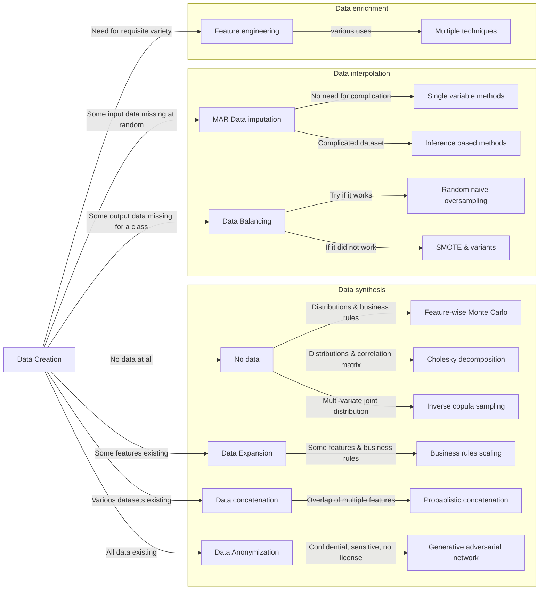

```mermaid
flowchart LR
    datacreation[Data Creation]

    subgraph data_synth[Data synthesis]
    no_data[No data]
    create_mc[Feature-wise Monte Carlo]
    create_cholesky[Cholesky decomposition]
    create_copula[Inverse copula sampling]
    data_expand[Data Expansion]
    expand_business[Business rules scaling]
    data_concat[Data concatenation]
    concat_fuzzi[Probablistic concatenation]
    data_anon[Data Anonymization]
    anon_gan[Generative adversarial network]
    end

    subgraph data_interp[Data interpolation]
    data_input[MAR Data imputation]
    input_single[Single variable methods]
    input_infer[Inference based methods]
    data_balans[Data Balancing]
    oversample_random[Random naive oversampling]
    oversample_smote[SMOTE & variants]
    end
    
    subgraph data_engin[Data enrichment]
    enginer_f[Feature engineering]
    engine_method[Multiple techniques]
    end
    
    datacreation-->|No data at all| no_data
    datacreation-->|Some input data missing at random| data_input
    datacreation-->|Some output data missing for a class| data_balans
    datacreation-->|Need for requisite variety| enginer_f
    datacreation-->|Some features existing| data_expand
    datacreation-->|Various datasets existing| data_concat
    datacreation-->|All data existing| data_anon    

    data_input-->|No need for complication| input_single
    data_input-->|Complicated dataset| input_infer

    data_balans-->|Try if it works| oversample_random
    data_balans-->|If it did not work| oversample_smote

    no_data-->|Distributions & business rules| create_mc
    no_data-->|Distributions & correlation matrix| create_cholesky
    no_data-->|Multi-variate joint distribution| create_copula

    data_expand-->|Some features & business rules| expand_business

    data_concat-->|Overlap of multiple features| concat_fuzzi

    data_anon-->|Confidential, sensitive, no license| anon_gan
    
    enginer_f-->|various uses| engine_method
```
